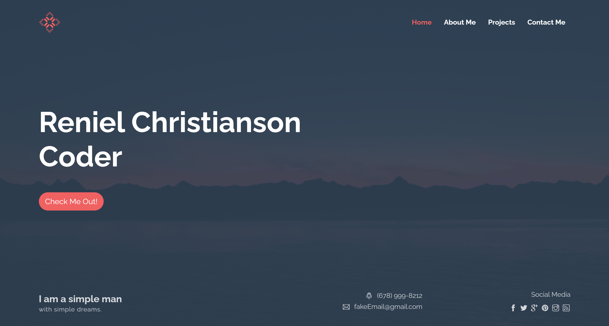

## Title: Portfolio Update Page 2
## Description:
This is my portfolio update page 2 with a very clean and polished look to it! 
## License:

Please code responsibly
## Screenshot:
 
## Installation:
(1) Go to my GitHub page "waldo-22" and navigate to "portfolioUpdate3" repository. (2)click on deployed link.
## Usage:
View my awesome portfolio and click on links! Also, contact me if need be.
## Credits:
Spencer Creer
## Questions,Comments,Concerns:
Contact me via email and phone number ect. Email: waldochristianson@gmail.com PhoneNumber: 678-999-8212 LinkedIn:https://www.linkedin.com/in/reniel-christianson-677575189/ GitHub: https://github.com/waldo-22